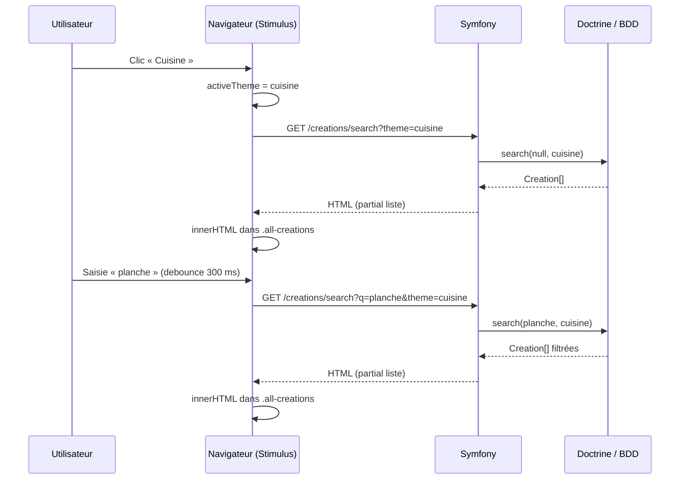

# Filtres et recherche sur la page des créations

Ce document décrit le fonctionnement du filtrage par **thème**, de la **recherche par titre**, et de leur **combinaison**, depuis l’interface jusqu’à la base de données.

---

## 1. Vue d’ensemble

La page liste les créations (`/creations`). L’utilisateur peut :

1. Choisir un **thème** via des boutons (Tous, Cuisine, Décoration, Objets).
2. Saisir du texte dans une **barre de recherche** (filtrage sur le **titre** des créations).

Les deux critères sont **cumulatifs** : si un thème autre que « Tous » est sélectionné, la recherche ne porte que sur les créations de ce thème dont le titre correspond à la saisie.

La liste est mise à jour **sans rechargement complet de la page** : le JavaScript interroge le serveur, récupère un **fragment HTML** (même partial Twig que le rendu initial), puis remplace le contenu de la zone liste.

---

## 2. Fichiers concernés

| Rôle | Fichier |
|------|---------|
| Page et structure HTML | `templates/frontOffice/creation/index.html.twig` |
| Fragment liste (cartes + message vide) | `templates/frontOffice/creation/_creation_list.html.twig` |
| Logique front (Stimulus) | `assets/controllers/filters_controller.js` |
| Routes et réponses HTTP | `src/Controller/FiltersController.php` |
| Requêtes base de données | `src/Repository/CreationRepository.php` (méthode `search`) |
| Entités liées | `src/Entity/Creation.php`, `src/Entity/Theme.php` |
| Chargement du contrôleur Stimulus | `importmap.php` / entrée `creation` selon configuration du projet |

---

## 3. Structure de la page (Twig)

### 3.1 Contrôleur Stimulus

La section principale porte l’attribut `data-controller="filters"` : tout le comportement décrit ici est rattaché à ce contrôleur Stimulus.

```twig
<section class="creations-section" data-controller="filters">
```

### 3.2 Barre de recherche

L’input déclenche une action Stimulus sur chaque frappe, avec **anti-rebond (debounce)** de 300 ms pour limiter le nombre de requêtes HTTP.

```twig
data-action="input->filters#searchByNameWithDebounce"
```

### 3.3 Boutons de thème

Chaque bouton expose la valeur du thème via `data-theme` :

- `all` : aucun filtre thème (toutes les créations, sous réserve du texte de recherche).
- Sinon : identifiant aligné sur la base (voir section 7) — par exemple `cuisine`, `decoration`, `objet`.

La classe `active` sur un bouton reflète le thème courant côté interface (le bouton « Tous » est marqué `active` au chargement).

### 3.4 Zone de remplacement du HTML

**Important** : un seul conteneur porte la classe `all-creations`. C’est là que le JavaScript injecte le HTML renvoyé par le serveur. Les cartes individuelles ne doivent **pas** réutiliser cette classe (sinon seul le premier nœud serait mis à jour et des cartes obsolètes resteraient visibles).

```twig
<div class="container all-creations">
    
</div>
```

---

## 4. Logique front-end (`filters_controller.js`)

### 4.1 État conservé en mémoire

| Propriété | Rôle |
|-----------|------|
| `activeTheme` | Thème sélectionné (`'all'` ou la valeur de `data-theme`, ex. `cuisine`). Initialisé à `'all'` au `connect()`. |
| `searchTimeout` | Identifiant du temporisateur du debounce sur la recherche. |
| `_onFilterClick` | Référence à la fonction de clic (pour pouvoir la retirer au `disconnect()`). |

L’état du thème **n’est pas** dans l’URL du navigateur ni dans un cookie : il vit uniquement dans l’instance du contrôleur Stimulus tant que la page reste ouverte. Un rechargement complet réinitialise le thème à « Tous » (comportement par défaut du template).

### 4.2 Clic sur un bouton de filtre

1. `handleFilterClick` utilise `event.target.closest('.filter-button')` pour ignorer les clics à côté des boutons.
2. Lecture de `button.dataset.theme`.
3. Mise à jour de `activeTheme` (`'all'` si `data-theme="all"`).
4. Mise à jour des classes `active` sur les boutons.
5. Appel de `refreshList()`.

Si l’utilisateur a déjà du texte dans la barre de recherche, `refreshList()` enverra **à la fois** `theme` et `q` au serveur.

### 4.3 Saisie dans la barre de recherche

1. `searchByNameWithDebounce` annule le temporisateur précédent puis en programme un nouveau après **300 ms**.
2. À l’expiration, `searchByName()` appelle `refreshList()`.

`refreshList()` lit la valeur actuelle de l’input et le `activeTheme` pour construire la requête.

### 4.4 Construction de l’URL et `fetch`

```text
Base : /creations/search
Paramètres (query string) :
  - q    : présent seulement si le champ recherche n’est pas vide après trim.
  - theme : présent seulement si activeTheme n’est pas 'all'.
```

Exemples :

| Situation | URL appelée |
|-----------|-------------|
| Thème « Tous », recherche vide | `/creations/search` |
| Thème « Cuisine », recherche vide | `/creations/search?theme=cuisine` |
| Thème « Tous », recherche `tab` | `/creations/search?q=tab` |
| Thème « Cuisine `, recherche `tab` | `/creations/search?q=tab&theme=cuisine` |

La réponse est du **HTML** (pas du JSON). Le script fait :

```js
creationsContainer.innerHTML = html;
```

### 4.5 Cycle de vie Stimulus

- **`connect()`** : enregistre l’écouteur de clic sur `.filters` à l’intérieur de `this.element` (la section), initialise `activeTheme`.
- **`disconnect()`** : supprime l’écouteur et annule le debounce pour éviter fuites mémoire et callbacks orphelins.

---

## 5. Côté serveur (`FiltersController.php`)

### 5.1 Route principale

| Attribut | Valeur |
|----------|--------|
| Chemin | `/creations/search` |
| Nom | `creations.search` |
| Méthode | GET (implicite) |

Le contrôleur lit :

- `q` → texte de recherche (peut être `null` ou chaîne vide).
- `theme` → identifiant de thème (peut être absent, `all`, ou une valeur comme `cuisine`).

Puis il appelle `CreationRepository::search($query, $theme)` et rend le partial `_creation_list.html.twig` avec la variable `creations`.

### 5.2 Routes secondaires (compatibilité ou usages isolés)

| Chemin | Nom | Usage |
|--------|-----|--------|
| `/all-creations` | `all.creations` | Liste sans filtre thème ni texte (équivalent logique à `search(null, 'all')`). Peut servir si un autre script appelle encore cette URL. |
| `/creations/search-by-theme` | `creations.search_by_theme` | Filtre uniquement par `theme`, sans `q`. Délègue à `search(null, $theme)`. |

Le flux principal de la page créations utilise **`/creations/search`** pour tous les cas (thème seul, texte seul, ou les deux).

---

## 6. Couche données (`CreationRepository::search`)

### 6.1 Signature

```php
public function search(?string $query, ?string $theme): array
```

Les méthodes `searchByName` et `searchByTheme` existent toujours et **délèguent** à `search` pour ne pas dupliquer la logique.

### 6.2 Comportement

1. **Tri** : `createdAt` décroissant.
2. **Filtre thème** — appliqué si `theme` est non vide et différent de `all` (comparaison insensible à la casse) :
   - `INNER JOIN` sur l’entité `Theme` alias `t`.
   - Condition : **égalité insensible à la casse sur le slug** **OU** **nom du thème en `LIKE`** avec caractères jokers autour de la valeur reçue.  
   Cela permet d’aligner les boutons soit sur le **slug** Gedmo en base, soit sur une partie du **nom** affiché.
3. **Filtre titre** — appliqué si `q` est non vide après trim :
   - `LOWER(c.title) LIKE LOWER(:query)` avec paramètre `'%' . trim($query) . '%'` (sous-chaîne, pas égalité stricte).

Si aucun des deux filtres n’est actif, la requête retourne **toutes** les créations (ordonnées).

### 6.3 Schéma relationnel utile

```text
Creation ──many-to-one──► Theme
         (champ theme obligatoire sur Creation)
```

---

## 7. Alignement boutons ↔ base de données

Les valeurs `data-theme` des boutons doivent correspondre à ce que la requête peut résoudre :

- **Recommandé** : utiliser le **slug** du thème en base (colonne `slug` de `Theme`), identique à celui généré par Gedmo à partir du nom.
- **Alternative** : une valeur contenue dans le **nom** du thème (le `LIKE` sur le nom), en gardant à l’esprit les accents et la casse (comparaison en `LOWER`).

Exemple : si le thème s’appelle « Décoration » et le slug est `decoration`, le bouton `data-theme="decoration"` est cohérent avec la branche « slug » de la condition.

---

## 8. Transit des données (vue globale)

Le schéma ci-dessous résume le flux lorsque l’utilisateur a choisi « Cuisine » puis tape dans la recherche.



---

## 9. Rendu du fragment liste

Le partial `_creation_list.html.twig` :

- boucle sur `creations` et affiche une carte par création (image, titre, nom du thème, description) ;
- si la collection est vide, affiche le message « Aucune création trouvée ».

Ce même partial est utilisé :

- au **premier rendu** de la page (inclus depuis `index.html.twig`) ;
- après **chaque** réponse AJAX de `/creations/search` (ou des routes secondaires).

---

## 10. Limites et pistes d’évolution

| Sujet | Détail |
|-------|--------|
| Pas de JSON API | Le contrat entre front et back est « HTML partiel ». Pour une SPA ou des clients multiples, on pourrait exposer du JSON et laisser le front construire le DOM. |
| Recherche sur le titre uniquement | La description et d’autres champs ne sont pas interrogés par `search` actuellement. |
| Correspondance « égalité stricte » titre | Aujourd’hui c’est un `LIKE` avec jokers. Pour une égalité exacte, il faudrait adapter la clause SQL dans le repository. |
| État après F5 | Le thème actif n’est pas dans l’URL ; un rechargement repart sur le HTML initial (bouton Tous + liste complète côté serveur selon `CreationController::index`). |

---

## 11. Récapitulatif des paramètres HTTP

| Paramètre | Obligatoire | Effet |
|-----------|-------------|--------|
| `q` | Non | Filtre sur le titre (sous-chaîne, insensible à la casse). |
| `theme` | Non | Filtre sur le thème (slug ou nom selon la condition en repository). Absent ou `all` : pas de filtre thème. |

Les deux paramètres sont **indépendants** côté serveur mais **combinés** avec un ET logique en base (créations qui satisfont **à la fois** les conditions activées).

---

*Document généré pour le projet PhotosRutile — à maintenir en phase avec le code source.*
